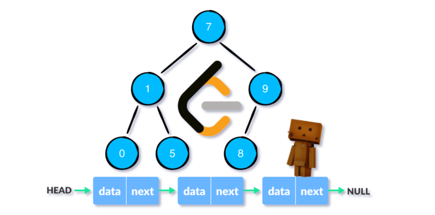
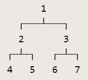

链表和二叉树是非常经典的数据结构，许多算法都是基于这两个数据结构之上的。最近刷了不少LeetCode上面相关的题目，发现这两种数据结构由于没有适当的输出函数或是表示形式，难以在本地进行调试，因此就想写一个关于链表与二叉树的相关模板。

模板基于LeetCode上的结构体定义，使用C++语言编写，支持链表和二叉树的创建与输出。

<!-- more -->

## 单链表

### 结构体定义

以LeetCode第二题[两数相加](https://leetcode-cn.com/problems/add-two-numbers/)为例，代码模板中给出了单链表的结构体定义：

```cpp
// 单链表定义
struct ListNode {
    int val;
    ListNode *next;
    ListNode() : val(0), next(nullptr) {}
    ListNode(int x) : val(x), next(nullptr) {}
    ListNode(int x, ListNode *next) : val(x), next(next) {}
};
```

### 表示形式

链表由于是线性结构，因此表示形式比较简单。采用`3 -> 2 -> 1`的形式来表示单链表。

### 创建单链表

通常来说创建上面的链表需要写如下代码：

```cpp
ListNode *root = new ListNode(3, new ListNode(2, new ListNode(1)));
```

非常不直观，而且当结点数较多时编码麻烦，容易出错。采用C++11提供的可变参数模板技术编写`create_list`函数来创建一个单链表，目标是简化创建链表的过程。例如上面的代码块可以写成：

```cpp
ListNode *root = create_list(3, 2, 1);
```

`create_list`的源代码如下：

```cpp
// 创建空链表
ListNode *create_list() { return nullptr; }
// 创建单链表
template <typename T, typename... Args>
ListNode *create_list(const T &first, const Args &...rest) {
    static_assert(std::is_same<T, int>::value);
    ListNode *head = new ListNode(first);
    head->next = create_list(rest...);
    return head;
}
```

### 输出单链表

输出的本质就是转换为字符串，因此先重载了`to_string`函数来将单链表转换为字符串。实现代码如下：

```cpp
string to_string(ListNode *head) {
    string res;
    while (head) {
        res.append(to_string(head->val));
        head = head->next;
        if (head) res.append(" -> ");
    }
    return res;
}
```

然后通过重载输出流的`<<`运算符即可用标准输出语法来进行输出了。

```cpp
// 输出单链表（指针形式）
ostream &operator<<(ostream &out, ListNode *head) {
    return (out << to_string(head));
}
```

### 使用示例

以[两数相加](https://leetcode-cn.com/problems/add-two-numbers/)这题为例，在编写完成类的成员函数之后，可以添加一个简单的`main`函数来进行测试：

```cpp
int main() {
    cout << Solution().addTwoNumbers(
        create_list(2,4,3),
        create_list(5,6,4)
    ) << endl;
    return 0;
}
```

输出结果：

```
7 -> 0 -> 8
```


## 二叉树

### 结构体定义

以[翻转二叉树](https://leetcode-cn.com/problems/invert-binary-tree/)为例，代码模板中给出了二叉树的结构体定义：

```cpp
// 二叉树结点定义
struct TreeNode {
    int val;
    TreeNode *left;
    TreeNode *right;
    TreeNode() : val(0), left(nullptr), right(nullptr) {}
    TreeNode(int x) : val(x), left(nullptr), right(nullptr) {}
    TreeNode(int x, TreeNode *left, TreeNode *right)
        : val(x), left(left), right(right) {}
};
```

### 表示形式

想为二叉树找到一种方便易用的表示形式不是那么容易。不同于链表，二叉树并非线性结构。一开始的想法是使用特殊字符在控制台以文本形式直接绘制二叉树，如下所示：

```txt
      1
  ┌───┴───┐
  2       3
┌─┴─┐   ┌─┴─┐
4   5   6   7
```

由于不同系统的字体不同，因此上面的显示可能出现乱码的情况，实际的效果可以参考下图所示：




这确实非常直观，但给解析带来了非常大的难度，而且不方便输入。实际需要的是一种能快速进行转换的、线性的表示形式。参考算法竞赛中的树结构的输入形式，通常是指定结点数以及每个节点的左右孩子，例如上面的二叉树可以表示成：

```
7
1 2 3
2 4 5
3 6 7
4 -1 -1
5 -1 -1
6 -1 -1
7 -1 -1
```

这样解析和输入都很方便，缺点就是不够直观。最终选择了一种括号表示法，上面的二叉树可以表示成：

```
1 (2 4 5) (3 6 7)
```

总体还是非常容易理解的，也比较直观，该表示法详细定义如下：

> 二叉树T可以按如下方式表示：
> 
> 1. 若T为空树，可表示为`()`。
> 2. 若T只包含一个节点，则可表示为一个数字。
> 3. 设T的左子树表示为L，右子树表示为R，T的值为N，则T可表示为`(N L R)`。
> 4. 最终结果的最外层括号可以省略。

一个更复杂的例子如下图所示：


它可以表示成：`3 (5 6 (2 7 4)) (1 0 8)`。

### 创建二叉树

明确了表示形式后，下一个目标就是实现从字符串解析出二叉树结构。这里采用了编译原理中的递归下降子程序的方法进行解析，实现代码如下：

```cpp
// 创建一个空二叉树（返回空指针）
TreeNode *create_tree() { return nullptr; }

// 从字符串创建一颗二叉树
// 格式类似于：1 (2 3 4) (5 () 6)
TreeNode *create_tree(const std::string &str) {
    string s(str);
    if (s.front() != '(') {
        s.insert(s.begin(), '(');
        s.insert(s.end(), ')');
    }
    size_t n = s.length();
    auto expect_int = [&](size_t &i) {
        int ans = 0;
        while (i < n && s[i] == ' ') i++;
        if (i == n || !isdigit(s[i])) return -1;
        while (i < n && isdigit(s[i])) {
            ans = ans * 10 + s[i] - '0';
            i++;
        }
        return ans;
    };
    std::function<TreeNode *(size_t &)> expect_node = [&](size_t &i) {
        while (i < n && s[i] != '(' && !isdigit(s[i])) i++;
        TreeNode *node = nullptr;
        bool flag = false;
        if (i < n && s[i] == '(') {
            flag = true;
            i++;
        }
        int val = expect_int(i);
        if (val >= 0) {
            node = new TreeNode(val);
            if (flag) {
                node->left = expect_node(i);
                node->right = expect_node(i);
            }
        }
        if (flag && i < n && s[i] == ')') i++;
        return node;
    };
    size_t i = 0;
    return expect_node(i);
}
```

算法过程如下，首先尝试在最外层添加括号，将整个表达式看作一个非终结符（节点），对应的子程序为`expect_node`。`flag`用于记录是否存在括号，接着尝试匹配终结符（数字），对应于子程序`expect_int`，它尝试从当前位置解析出一个数字，若不可行，则返回-1。若存在括号的话，就递归解析左右子节点。

### 输出二叉树

与单链表类似，同样重载`to_string`来将二叉树转换为字符串再进行输出，实现代码如下：

```cpp
// 将二叉树转换为字符串形式
string to_string(TreeNode *root) {
    if (!root) return "()";
    if (!root->left && !root->right) return to_string(root->val);
    return "(" + to_string(root->val) + " " + to_string(root->left) + " " +
           to_string(root->right) + ")";
}
```

即递归地将当前节点以及左右子树转换为字符串形式。同样重载`<<`运算符以支持标准流输出：

```cpp
// 输出二叉树
ostream &operator<<(ostream &out, TreeNode *root) {
    return (out << to_string(root));
}
```

### 使用示例

以[翻转二叉树](https://leetcode-cn.com/problems/invert-binary-tree/)这题为例，可以使用如下代码进行测试：

```cpp
int main() {
    cout << Solution().invertTree(
        create_tree("4 (2 1 3) (7 6 9)")
    ) << endl;
    return 0;
}
```

输出结果如下所示：

```
(4 (7 9 6) (2 3 1))
```


## 总结

将上面的所有代码以及对STL容器的输出支持整合成单个文件，使用时只要包含`leetcode.h`头文件即可。

```cpp
#ifndef LEETCODE_H
#define LEETCODE_H
// LeetCode 刷题模板 by tootal 20210331
#include <bits/stdc++.h>
using namespace std;

// 单链表定义
struct ListNode {
    int val;
    ListNode *next;
    ListNode() : val(0), next(nullptr) {}
    ListNode(int x) : val(x), next(nullptr) {}
    ListNode(int x, ListNode *next) : val(x), next(next) {}
};

// 创建空链表
ListNode *create_list() { return nullptr; }
// 创建单链表
template <typename T, typename... Args>
ListNode *create_list(const T &first, const Args &...rest) {
    static_assert(std::is_same<T, int>::value);
    ListNode *head = new ListNode(first);
    head->next = create_list(rest...);
    return head;
}

// 二叉树结点定义
struct TreeNode {
    int val;
    TreeNode *left;
    TreeNode *right;
    TreeNode() : val(0), left(nullptr), right(nullptr) {}
    TreeNode(int x) : val(x), left(nullptr), right(nullptr) {}
    TreeNode(int x, TreeNode *left, TreeNode *right)
        : val(x), left(left), right(right) {}
};

// 创建一个空二叉树（返回空指针）
TreeNode *create_tree() { return nullptr; }

// 从字符串创建一颗二叉树
// 格式类似于：1 (2 3 4) (5 () 6)
TreeNode *create_tree(const std::string &str) {
    string s(str);
    if (s.front() != '(') {
        s.insert(s.begin(), '(');
        s.insert(s.end(), ')');
    }
    size_t n = s.length();
    auto expect_int = [&](size_t &i) {
        int ans = 0;
        while (i < n && s[i] == ' ') i++;
        if (i == n || !isdigit(s[i])) return -1;
        while (i < n && isdigit(s[i])) {
            ans = ans * 10 + s[i] - '0';
            i++;
        }
        return ans;
    };
    std::function<TreeNode *(size_t &)> expect_node = [&](size_t &i) {
        while (i < n && s[i] != '(' && !isdigit(s[i])) i++;
        TreeNode *node = nullptr;
        bool flag = false;
        if (i < n && s[i] == '(') {
            flag = true;
            i++;
        }
        int val = expect_int(i);
        if (val >= 0) {
            node = new TreeNode(val);
            if (flag) {
                node->left = expect_node(i);
                node->right = expect_node(i);
            }
        }
        if (flag && i < n && s[i] == ')') i++;
        return node;
    };
    size_t i = 0;
    return expect_node(i);
}

// to_string系列函数定义
string to_string(bool x);
string to_string(char c);
string to_string(const char *s);
string to_string(string s);
template <typename T1, typename T2>
string to_string(pair<T1, T2> x);
template <typename T>
string to_string(vector<T> x);
template <typename T>
string to_string(stack<T> x);
template <typename T>
string to_string(queue<T> x);
string to_string(ListNode *head);
string to_string(TreeNode *root);

// to_string系列函数实现
string to_string(bool x) { return x ? "true" : "false"; }
string to_string(char c) { return "\'" + string(1, c) + "\'"; }
string to_string(const char *s) { return "\"" + string(s) + "\""; }
string to_string(string s) { return "\"" + s + "\""; }

template <typename T1, typename T2>
string to_string(pair<T1, T2> x) {
    return "(" + to_string(x.first) + ", " + to_string(x.second) + ")";
}

template <typename T>
string to_string(vector<T> x) {
    string res = "{";
    bool first = true;
    for (auto &&i : x) {
        if (first) {
            first = false;
        } else {
            res += ", ";
        }
        res += to_string(i);
    }
    return res + "}";
}

// 将栈转换为字符串表示，形式如下：
// 栈底     栈顶
//  |        |
// [1, 3, 2, 4)
template <typename T>
string to_string(stack<T> x) {
    string res;
    bool first = true;
    while (!x.empty()) {
        if (first) {
            first = false;
        } else {
            res = ", " + res;
        }
        res = to_string(x.top()) + res;
        x.pop();
    }
    return "[" + res + ")";
}

// 将队列转换为字符串表示，形式如下：
// 队首     队尾
//  |        |
// (1, 3, 2, 4)
template <typename T>
string to_string(queue<T> x) {
    string res;
    bool first = true;
    while (!x.empty()) {
        if (first) {
            first = false;
        } else {
            res = res + ", ";
        }
        res = res + to_string(x.front());
        x.pop();
    }
    return "(" + res + ")";
}

string to_string(ListNode *head) {
    string res;
    while (head) {
        res.append(to_string(head->val));
        head = head->next;
        if (head) res.append(" -> ");
    }
    return res;
}

// 将二叉树转换为字符串形式
string to_string(TreeNode *root) {
    if (!root) return "()";
    if (!root->left && !root->right) return to_string(root->val);
    return "(" + to_string(root->val) + " " + to_string(root->left) + " " +
           to_string(root->right) + ")";
}

// 输出单链表（指针形式）
std::ostream &operator<<(std::ostream &out, ListNode *head) {
    return (out << to_string(head));
}

// 输出单链表（引用形式）
std::ostream &operator<<(std::ostream &out, ListNode &head) {
    return (out << &head);
}

// 输出二叉树
std::ostream &operator<<(std::ostream &out, TreeNode *root) {
    return (out << to_string(root));
}

template <typename T>
ostream &operator<<(ostream &out, vector<T> x) {
    return (out << to_string(x));
}

template <typename T>
ostream &operator<<(ostream &out, stack<T> x) {
    return (out << to_string(x));
}

template <typename T>
ostream &operator<<(ostream &out, queue<T> x) {
    return (out << to_string(x));
}

template <typename T1, typename T2>
ostream &operator<<(ostream &out, pair<T1, T2> x) {
    return (out << to_string(x));
}

// 使用示例
int showcase() {
    // 单链表
    ListNode *mylist = create_list(5, 4, 3, 2, 1);
    cout << mylist << '\n';
    // 二叉树
    TreeNode *mytree = create_tree("1 (2 3 4) (5 () 6)");
    cout << mytree << '\n';
    // pair
    cout << make_pair('a', 1) << '\n';
    cout << pair{1, pair{'a', "123"}} << '\n';
    cout << make_pair(create_list(3, 2), 123) << '\n';
    // vector
    cout << vector{1, 2, 3, 4, 5} << '\n';
    cout << vector{"abc", "123"} << '\n';
    cout << vector{true, false, false} << '\n';
    cout << vector{'1', '2', '3'} << '\n';
    // stack
    stack<int> st;
    for (int i = 0; i < 5; i++) st.push(i);
    cout << st << '\n';
    // queue
    queue<int> que;
    for (int i = 0; i < 5; i++) que.push(i);
    cout << que << '\n';
    return 0;
}

#endif // LEETCODE_H
```