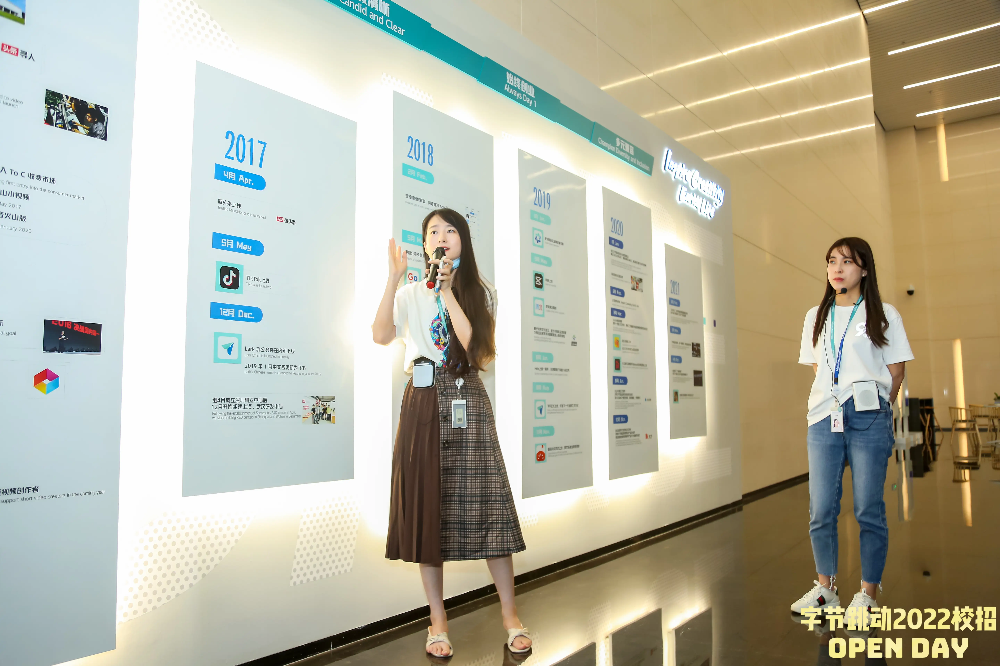

周六一大早，手环上震动的闹钟吵醒了我。广州的冬天还是那么温暖，我穿好衣服、收拾行李从宿舍走了出来，正如我平日里去实习一样。从宿舍骑车到地铁站，路上已经有不少学生已经在前往教学区的路上，大概是在准备考研或者期末考试吧。到达约定的上车地点时，车子还没来，焦急地等待了几十分钟后才终于坐上了大巴车。

<!-- more -->

汽车从广州开往深圳，搭载了约有三十人。一路上有鳞次栉比的高楼大厦，也有低矮破败的棚户小屋；有装满集装箱的江边码头，也有种满庄稼的绿色麦田。让人不由得感慨大湾区的发展差异巨大。经过两个多小时的长途跋涉，我们终于到达了目的地——深圳湾。

## 前台

下车之后，映入眼帘的是一座摩天大楼，外表铺满了光滑的玻璃，隐约可见室内的灯光。继续往里走，门口已经站着几位同学在迎接我们了。





一进大楼，我就被一块硕大的展板吸引了。这是一幅开放日活动的宣传海报，画面背景是一处海浪滔天的沙滩上，一些年轻人在肆意的玩耍。海报的画风明朗轻快，而且融入了不少公司的产品元素，相当有创意。在我到来时，海报前已经聚集了不少同学在拍照。

海报另一边是前台的位置，上面摆满了临时工牌以及活动的奖品。每个人都可以去领一个自己的工牌。工牌的绳子很特殊，有蓝色、绿色、灰色、黑色的，看上去是不同的部门使用了不同的颜色进行区分。





## 转角

走过前台来到转角处，这里贴着一幅更大的海报，画风类似但更为简洁。周围都是透明的大块玻璃，海报在明媚的阳光照射下更加耀眼了。温暖的阳关从窗外照射到光洁的地板上，将海报的倒影与现实重叠了起来，让我不由得沉醉在这梦幻的场景中，直到边上的抓娃娃机发出了欢快的音乐才将我拉回了现实。





接着我们所有人就在这里拍了两张合照。在摄影师的指导下我们拍了一张正式的和一张不正式的合照，其实是差不多的，不过是变换了一下姿势与阵型。





## 文化墙

大厅的另一角是公司的文化长廊，上面记录了从2012年字节跳动成立以来的所有重大事件。旁边设有简单的桌椅沙发，可供访客休息。





## 培训室

上午的第一个正式活动是去培训室听公司员工的技术分享。培训室很大，足够容纳一百人同时参与而不显得拥挤。





## 餐厅

培训完之后就到了午饭时间。午餐是不限量供应的自助餐。菜品非常丰富，鸡、鸭、虾、牛肉都有，还有三种配汤以及水果和饮料供应。此外还准备有特殊的清真餐以及简餐。





## 办公区

午餐过后，便是去办公地点参观。工位是连排的桌子相对摆放，中间用夹板隔开。工位的一侧是大楼的外层玻璃，向外可以看到城市的道路楼宇风景。除了办公区域外，还有行政服务台、IT服务台、小邮局、茶水间、健身房、哺乳室、卫生间等各种服务区域。





## 会议室

参观完工区后，就来到了部门的分享会。会上有部门主管以及去年校招的学长分享了自己的感悟和见解，期间我们也提出了一些问题来相互探讨交流。




## 大厅

分享结束后，我们回到了大厅，领取了一个加热鼠标垫礼品和一盒纪念勋章。





在大厅休息了一会后，我们登上了回程的大巴车。回去的路上，天色渐晚，已经看不清车窗外的景色了。

