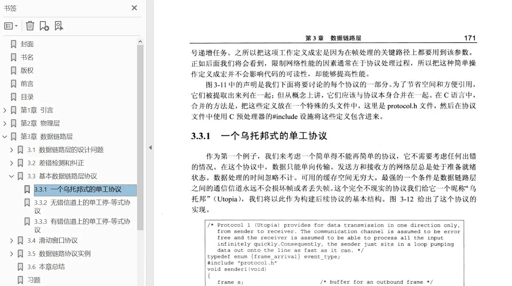

最近在找一些教材的PDF版本，有时候找到了PDF版本却没有目录，对于教材这种需要经常查阅的电子书来说，没有书签目录会导致效率大大降低。之前一直将就着用了，正好暑假小学期结束了，有一些空闲时间，这次我决定给PDF加上目录。
<!-- more -->
以我下学期的课程计算机网络为例，教材为《计算机网络（第五版）》清华大学出版社。百度搜索一下，在脚本之家找到了这本书的[电子版](https://pan.baidu.com/share/link?shareid=383287&uk=2769186556)。下载后发现虽然是扫描版的，质量还不错，但是缺点就是没有目录，不方便查阅。

首先使用[PDF Password Remover](http://dl-t1.wmzhe.com/34/34694/PDFPasswordr7.01.zip)去除PDF内置的密码，否则无法编辑。接下来就可以使用常规的PDF编辑软件对PDF进行编辑了，我使用Adobe Acrobat DC删去了一些多余的页面。虽然也可以添加目录，不过需要一个一个手动添加，对于有七百多页的大部头来说效率实在太低，于是我借助了其他一些工具批量添加。

首先需要获取书籍的完整目录，不需要从PDF版本的目录页进行识别，一般来说书籍的目录页信息都是公开的，在网上书店或者出版社的网站一般可以找到，例如《计算机网络》的目录即可在[清华大学出版社官网](http://www.tup.tsinghua.edu.cn/booksCenter/bookcatalog.html?id=03661501)找到。将它复制下来，存放在一个文本文件中，我命名为`data.txt`。

结构类似下面这样：

```txt
第1章  引言 1

1.1  使用计算机网络 2

1.1.1  商业应用 2

1.1.2  家庭应用 4

1.1.3  移动用户 8

1.1.4  社会问题 10
（省略余下部分）
```

接着使用[PDF Patcher](https://306t.com/dir/12751606-24910846-a73f67)，打开PDF文件，先添加几个书签，例如封面、前言等页，方便查看书签文件的结构。接着保存书签文件，即得到了类似以下格式的文件：

```xml
<?xml version="1.0" encoding="gb2312"?>
<PDF信息 程序名称="PDFPatcher" 程序版本="0.3.3" 导出时间="2020年08月30日 11:33:38" PDF文件位置="C:\Output\[计算机网络（第5版）].（美）特南鲍姆.扫描版_Password_Removed.pdf">
	<度量单位 单位="点" />
	<文档书签>
		<书签 文本="封面" 动作="转到页面" 页码="1" 显示方式="适合页宽"/>
		<书签 文本="书名" 动作="转到页面" 页码="2" 显示方式="适合页宽"/>
		<书签 文本="版权" 动作="转到页面" 页码="3" 显示方式="适合页宽"/>
		<书签 文本="前言" 动作="转到页面" 页码="4" 显示方式="适合页宽"/>
		<书签 文本="目录" 动作="转到页面" 页码="6" 显示方式="适合页宽"/>
		<书签 文本="第1章  引言" 动作="转到页面" 页码="15" 显示方式="适合页宽">
	</文档书签>
	<页码样式 />
</PDF信息>
```

注意文件的编码格式是GB2312，使用文本编辑器打开和保存的时候均需要注意格式问题。

根据这两个信息我们就可以使用脚本来处理目录数据，自动生成书签文件了。

我用的是Python脚本：

```py
def wrap(info, page):
    return '<书签 文本="{}" 动作="转到页面" 页码="{}" 显示方式="适合页宽">\n'.format(info, int(page)+14)
def handle(line):
    line = line.strip()
    p = line.rfind(' ')
    return line[:p], line[p + 1:]

with open('data.txt', 'r', encoding='utf-8') as fin:
    with open('out.xml', 'w', encoding='utf-8') as fout:
        lines = list(filter(lambda x: len(x.strip()) > 0, fin.readlines()))
        i = 0
        while i < len(lines) and '第' in lines[i] and '章' in lines[i]:
            info, page = handle(lines[i])
            fout.write(wrap(info, page))
            i += 1
            while i < len(lines) and (lines[i].split(' ')[0].count('.') == 1 or '习题' in lines[i]):
                info, page = handle(lines[i])
                fout.write(wrap(info, page))
                i += 1
                while i < len(lines) and lines[i].split(' ')[0].count('.') == 2:
                    info, page = handle(lines[i])
                    fout.write(wrap(info, page))
                    fout.write('</书签>\n')
                    i += 1
                fout.write('</书签>\n')
            fout.write('</书签>\n')

```

得到输出文件`out.xml`后，手动将其复制到原来的书签文件对应位置即可。

然后使用PDF Patcher导入书签文件，注意把之前的书签删除。




此外，如果觉得扫描版的PDF文件大小太大了，可以使用Acrobat DC中的优化PDF功能，优化文件大小。