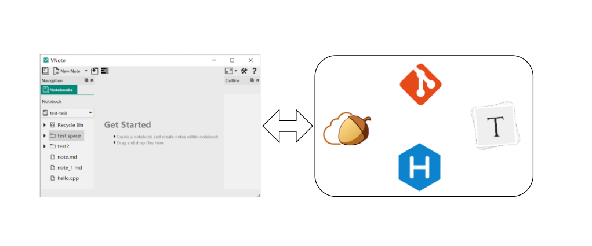

[VNote](https://vnotex.github.io/vnote/zh_cn/)是一款专为Markdown设计的Vim风格笔记应用程序。目前使用已经两年多了，平时用来记录、摘抄都挺方便的。略有不方便的地方就是VNote不能方便地运行一些外部工具，例如：

* 通过[Git](https://git-scm.com/)进行笔记的版本控制
* 将多个终端的笔记通过[坚果云](https://help.jianguoyun.com/?p=2064)进行同步
* 将写好的Markdown文档通过[Hexo](https://hexo.io/zh-cn/)渲染预览并发布
* 调用外部编辑器如[Typora](https://typora.io/)或是[VS Code](https://code.visualstudio.com/)进行进一步编辑

在本文中，我将为VNote设计实现一个任务系统来运行外部工具，从而解决上面这些问题。

<!-- more -->

这些常用的功能大多可以通过运行命令行工具来完成，鉴于它们的常用性，有必要将其集成在VNote内部，这样无需在需要调用外部工具时输入命令行，或是编写代码。在 [VNote 2.10](https://github.com/vnotex/vnote/releases/tag/v2.10) 版本中，添加了调用Git的功能。但局限性较大，无法进行扩展。

## 相关介绍

目前许多文本编辑器或是IDE都有执行外部命令的功能，它们的可配置性较高。例如VSCode的[Tasks](https://code.visualstudio.com/docs/editor/tasks) 、Sublime Text的[Build Systems](https://www.sublimetext.com/docs/3/build_systems.html) 、IntelliJ IDEA的[External Tools](https://www.jetbrains.com/help/idea/2020.3/settings-tools-external-tools.html) 、Qt Creator的[External Tools](https://doc.qt.io/qtcreator/creator-editor-external.html) 以及Visual Studio的[External tools](https://docs.microsoft.com/en-us/visualstudio/ide/managing-external-tools?f1url=%3FappId%3DDev16IDEF1%26l%3DEN-US%26k%3Dk(VS.ExternalTools)%26rd%3Dtrue&view=vs-2019) 。VNote的任务系统主要参考的是VSCode的[Tasks](https://code.visualstudio.com/docs/editor/tasks) ，并结合了其它实现的一些优点。由于VNote [v2版本代码](https://github.com/vnotex/vnote/tree/vnote2.0)不再维护，且v3版本已处于beta阶段，因此任务系统首先考虑在v3版本添加。此外，由于内容较多，下面列出的一些功能仅仅是设计阶段的一些想法，并未完全实现。尚未实现的功能均有所标注。

要知道运行什么任务、如何运行，必须进行配置。综合来看，目前的配置方式主要分为两大类：编写配置文件、图形化配置界面。其中VSCode采用的是[.vscode/tasks.json](https://code.visualstudio.com/docs/editor/tasks-appendix)配置文件，Sublime Text采用的是[name.sublime-build](https://www.sublimetext.com/docs/3/build_systems.html#options)配置文件，均为类似JSON格式的配置文件。配置文件示例如下所示：


<!-- tab VSCode配置文件 -->

```json
{
    // See https://go.microsoft.com/fwlink/?LinkId=733558
    // for the documentation about the tasks.json format
    "version": "2.0.0",
    "tasks": [
        {
            "label": "Run tests",
            "type": "shell",
            "command": "./scripts/test.sh",
            "windows": {
                "command": ".\\scripts\\test.cmd"
            },
            "group": "test",
            "presentation": {
                "reveal": "always",
                "panel": "new"
            }
        }
    ]
}
```

<!-- endtab -->

<!-- tab Sublime Text配置文件 -->

```json
{
    "shell_cmd": "g++ \"${file}\" -o \"${file_path}/${file_base_name}\"",
    "file_regex": "^(..[^:]*):([0-9]+):?([0-9]+)?:? (.*)$",
    "working_dir": "${file_path}",
    "selector": "source.c++",
    "variants": [
        {
            "name": "Run",
            "shell_cmd": "g++ \"${file}\" -o \"${file_path}/${file_base_name}\" && \"${file_path}/${file_base_name}\""
        }
    ]
}
```

<!-- endtab -->


其余IDE大多采用图形化配置，如下图所示。



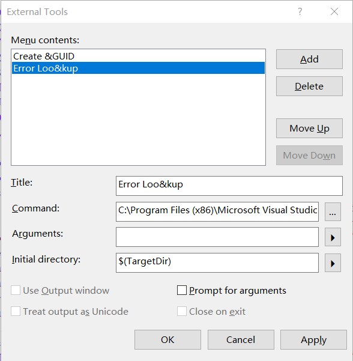
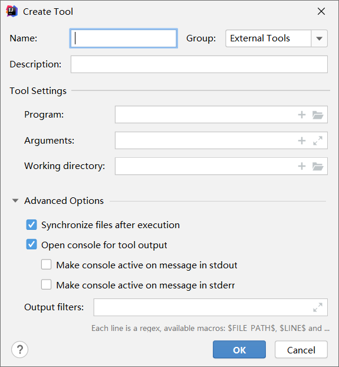
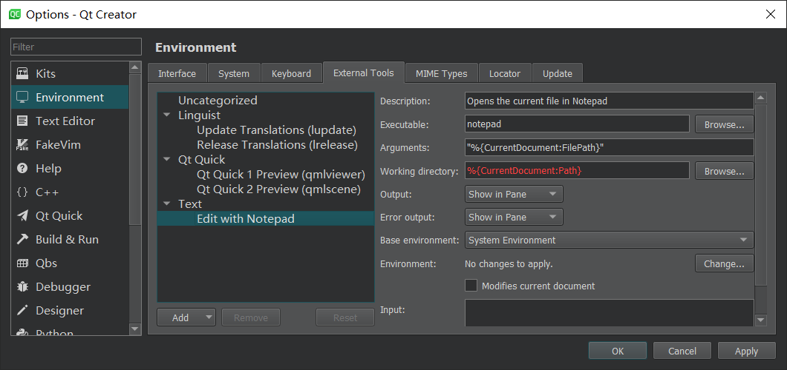



考虑到目前VNote也是主要采用JSON格式的配置文件，因此任务系统也通过JSON文件进行配置。后续会考虑在设置里添加图形化配置方式。

## 下载开发版本

目前任务系统仍然处于开发过程中，可以[在此](https://github.com/tootal/vnote/tree/feature/tasksystem)查看相关代码。

通过下面的按钮可以下载包含任务系统功能的测试版本：



[Windows x64@fab-windows, button, is-primary](https://github.com/tootal/vnote/suites/4480312213/artifacts/119308698)
[Windows x86@fab-windows, button, is-info](https://github.com/tootal/vnote/suites/4480312213/artifacts/119308699)
[macOS@fab-apple, button, is-dark](https://github.com/tootal/vnote/suites/4480312212/artifacts/119308022)
[Linux@fab-linux, button, is-warning](https://github.com/tootal/vnote/suites/4480312214/artifacts/119307742)



如果你对VSCode Task熟悉，想知道它们之间有什么区别，可以直接查看[对比VSCode Task](#VS-Code-Task)。

## 快速上手

### Hello World

一个最简单的示例莫过于在屏幕上输出`helloworld`了。通过右上角的设置菜单打开用户配置文件夹。

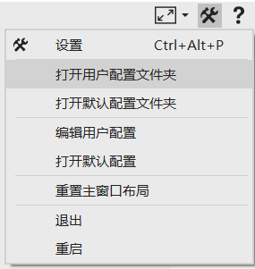

在`tasks`文件夹内新建一个`hello.json`文件，输入如下内容。

```json
{
    "command": "echo helloworld"
}
```

保存文件后，可以发现主菜单多了一个`hello`菜单项，点击该菜单项即可运行上述任务。

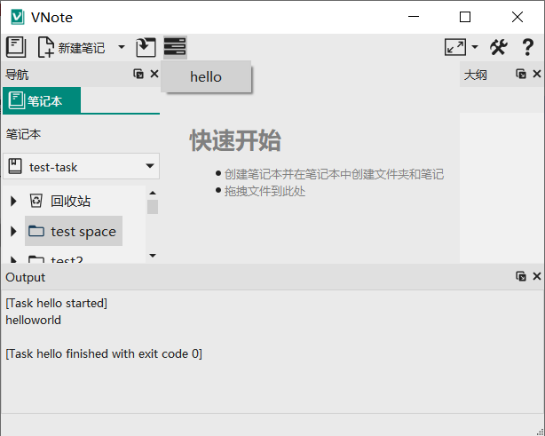


运行任务时会自动弹出下方的输出面板，在输出面板可以查看任务运行过程中的输出信息。如果你看到了`helloworld`显示在下方的输出面板中，说明任务运行成功了。在默认情况下，VNote会把命令传递给系统默认的命令解释器（Windows平台使用`PowerShell.exe`，Linux和macOS平台使用`/bin/bash`）执行，并接收输出的结果显示在输出面板上。对于支持的所有配置项及其含义，请参考[任务配置](#任务配置)。

### 自定义菜单项

对于每个任务，VNote会自动在主界面生成一个菜单项与之对应，默认使用文件名或命令值作为菜单名称。通过`label`、`icon`以及`shortcut`可以指定任务的名称（Hello）、图标（[tasks-solid.svg](https://fontawesome.com/icons/tasks?style=solid)）以及快捷键（`Alt+H, T`）。

```json
{
    "label": "Hello",
    "icon": "tasks-solid.svg",
    "shortcut": "Alt+H, T",
    "command": "echo",
    "args": [
        "Hello tasks!"
    ]
}
```

此时主界面的菜单项会加上图标及快捷键。按快捷键`Alt+H, T`即可运行该任务。


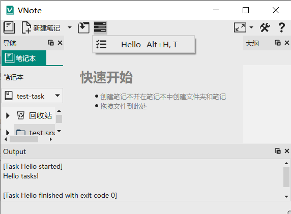
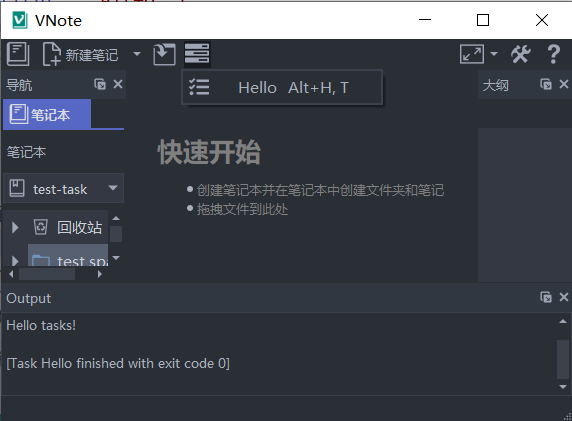
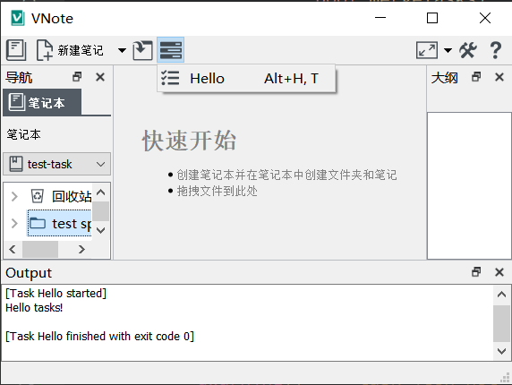


提示：尽量使用SVG格式的图标，VNote会根据当前主题调整图标颜色，以达到更好的显示效果。

任务同时还可以包含若干个子任务，支持无限层级的嵌套，在菜单栏中展示为多级子菜单。如下是一个`Hello Tasks`任务，包含三个子任务`Hello Cat`、`Hello Dove`和`Hello Fish`。

```json
{
    "label": "Hello Tasks",
    "icon": "tasks-solid.svg",
    "shortcut": "Alt+H, T",
    "command": "echo",
    "args": ["Hello tasks!"],
    "tasks": [
        {
            "label": "Hello Cat",
            "icon": "cat-solid.svg",
            "shortcut": "Alt+H, C",
            "args": ["Hello cat!"]
        },
        {
            "label": "Hello Dove",
            "icon": "dove-solid.svg",
            "shortcut": "Alt+H, D",
            "args": ["Hello dove!"]
        },
        {
            "label": "Hello Fish",
            "icon": "fish-solid.svg",
            "shortcut": "Alt+H, F",
            "args": ["Hello fish!"]
        }
    ]
}
```

上面的子任务没有配置`command`但依然可以执行，这是因为子任务会从父任务中继承大部分常见属性（如`type`、`command`、`args`）。

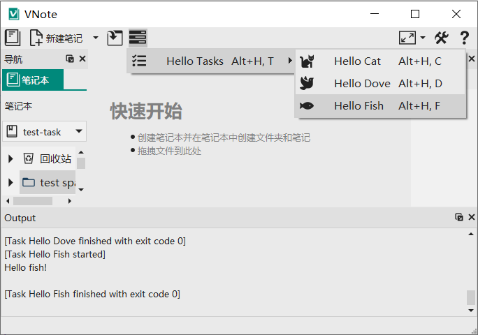

注意：请尽量不要在包含子任务的任务中配置命令，因为菜单项的点击操作默认实现为展开下一级菜单，从而导致无法通过点击菜单项来触发任务执行，但仍然可以通过快捷键方式执行任务。

### 特殊字符处理

当命令或参数包含特殊字符（如空格）时通常需要进行特殊的处理，由于不同命令解释器的语法大相径庭，没有统一的处理方法。默认情况下，VNote会进行如下处理。

当满足下面所有条件时，VNote会自动在**参数**两端加上双引号。

* 当不指定`type`或`type`为`shell`
* 同时指定`command`和`args`
* 参数中包含空格


当满足下面所有条件时，VNote会用空格分隔将命令和参数合并成一个字符串并在两端加上双引号，同时转义内部的双引号。

* 当不指定`type`或`type`为`shell`
* 当`shell`为`bash`

例如在Linux下运行之前的Hello Tasks 示例，命令将被处理成：（可在运行日志中查看）

`run task "/bin/bash" ("-c", "echo \\\"Hello tasks!\\\"")`

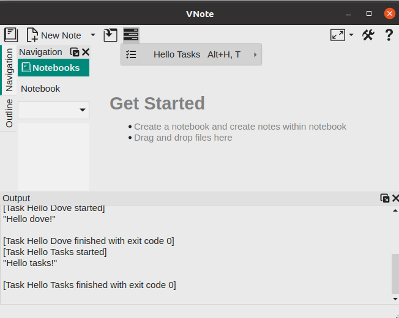

输出结果两端会出现多余的双引号，通过仅指定`command`或用`process`方式启动任务可以手动处理特殊字符。

### 启动外部程序

默认情况下`command`会作为shell命令执行（即默认`type`为`shell`），通过指定`type`为`process`可以将`command`作为外部程序运行。下面是一个示例，在Typora或VS Code中打开当前文件。其中`${file}`是一个变量，会在运行时替换为当前打开的文件路径。关于变量的更多信息，请参考[变量替换](#变量替换)。


<!-- tab Windows@fab-windows -->

```json
{
    "type": "process",
    "label": "Open File with",
    "args": ["${file}"],
    "tasks": [
        {
            "label": "Typora",
            "icon": "Typora.svg",
            "command": "C:\\Programs\\Typora0.9.98\\x64\\Typora.exe"
        },
        {
            "label": "VS Code",
            "icon": "vscode.svg",
            "command": "C:\\Users\\tootal\\AppData\\Local\\Programs\\Microsoft VS Code\\Code.exe"
        }
    ]
}
```

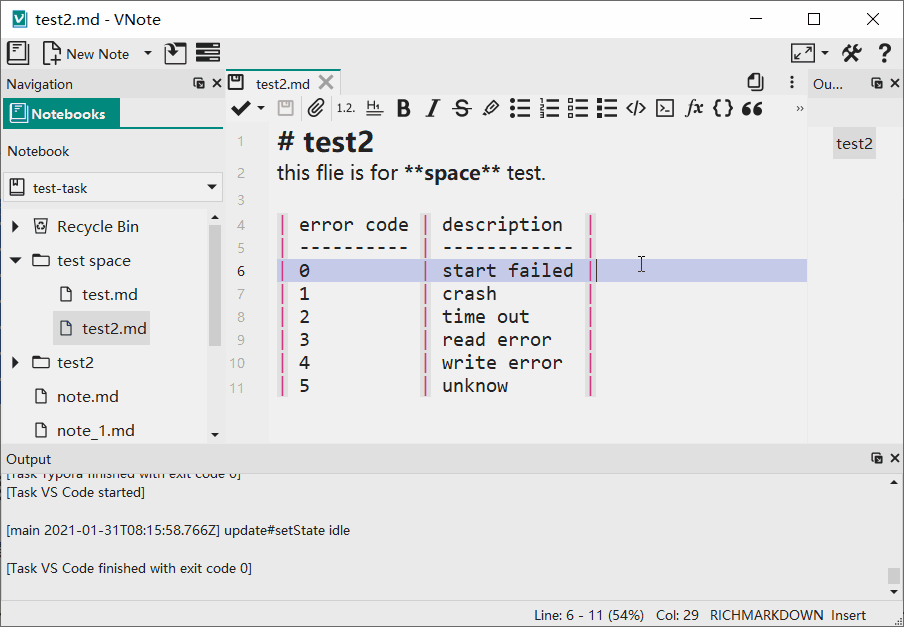
<!-- endtab -->

<!-- tab Linux@fab-linux -->
```json
{
    "type": "process",
    "label": "Open File with",
    "args": ["${file}"],
    "tasks": [
        {
            "label": "Typora",
            "icon": "Typora.svg",
            "command": "/usr/bin/typora"
        },
        {
            "label": "VS Code",
            "icon": "vscode.svg",
            "command": "/usr/bin/code"
        }
    ]
}
```

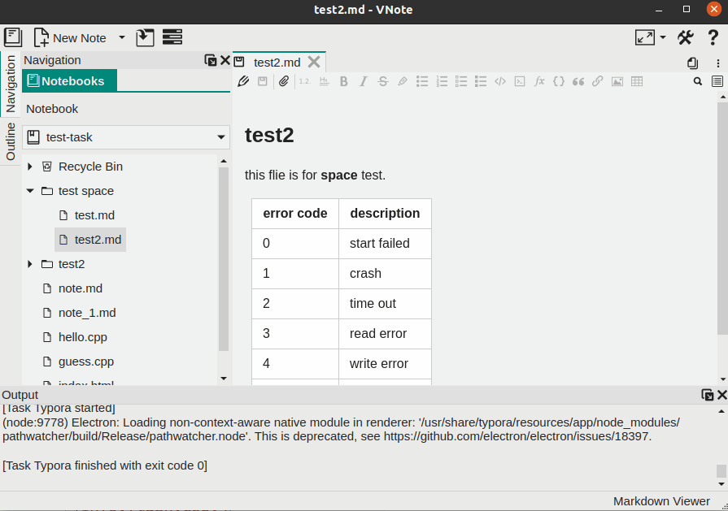

<!-- endtab -->



由于VNote默认不包含控制台窗口，因此启动一些命令行程序时可能会出现问题，此时可以通过`shell`命令启动一个单独的窗口来解决。对于Windows可以用`start vim.exe`，对于Linux平台可以用`gnome-terminal`、`konsole`或`xterm`等。

```json
{
    "label": "Vim",
    "icon": "vim.svg",
    "type": "process",
    "command": "gnome-terminal",
    "args": [
        "--execute",
        "vim",
        "${file}"
    ]
}
```

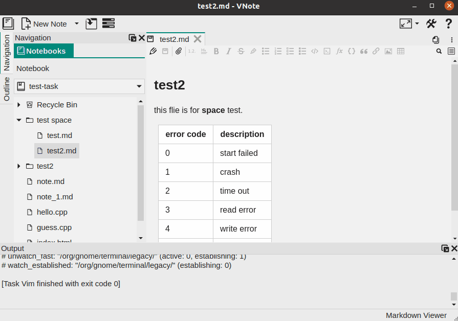

### 多语言与多平台

任务配置文件支持针对特定平台进行配置，通过`windows`、`linux`或`osx`属性可以指定Windows、Linux、macOS平台下特定的配置。平台特定配置会对基础配置进覆盖，但`tasks`配置会进行合并。例如可以将上面的启动外部程序的配置文件合并，使其在Windows平台和Linux平台均能正常工作。

```json
{
    "type": "process",
    "label": "Open File with",
    "args": ["${file}"],
    "tasks": [
        {
            "label": "Typora",
            "icon": "Typora.svg",
            "windows": {
                "command": "C:\\Programs\\Typora0.9.98\\x64\\Typora.exe"
            },
            "linux": {
                "command": "/usr/bin/typora"
            }
        },
        {
            "label": "VS Code",
            "icon": "vscode.svg",
            "windows": {
                "command": "C:\\Users\\tootal\\AppData\\Local\\Programs\\Microsoft VS Code\\Code.exe"
            },
            "linux": {
                "command": "/usr/bin/code"
            }
        }
    ]
}
```

任务配置文件也支持多语言配置，对于`label`、`command`、`args`属性，除字符串外还可传入一个`LocaleString`对象。

```json
{
    "label": {
        "en_US": "Hello",
        "zh_CN": "你好"
    },
    "icon": "tasks-solid.svg",
    "command": "echo",
    "tasks": [
        {
            "label": {
                "en_US": "Cat",
                "zh_CN": "猫"
            },
            "icon": "cat-solid.svg",
            "shortcut": "Alt+H, C",
            "args": [
                {
                    "en_US": "Hello cat!",
                    "zh_CN": "你好，猫！"
                }
            ]
        },
        {
            "label": {
                "en_US": "Dove",
                "zh_CN": "鸽子"
            },
            "icon": "dove-solid.svg",
            "shortcut": "Alt+H, D",
            "args": [
                {
                    "en_US": "Hello dove!",
                    "zh_CN": "你好，鸽子！"
                }
            ]
        },
        {
            "label": "Fish",
            "icon": "fish-solid.svg",
            "shortcut": "Alt+H, F",
            "args": [
                {
                    "en_US": "Hello fish!",
                    "zh_CN": "你好，鱼！"
                }
            ]
        }
    ]
}
```

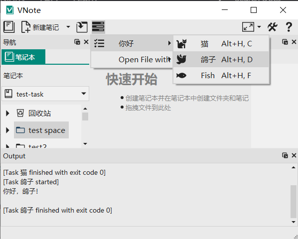

注意：切换VNote语言后需要重启才能生效。

### 任务运行出错

当任务运行出错时，会在输出面板显示错误消息，例如：

```
[Task Typora error occurred with code 0]
```

其中[错误代码](https://doc.qt.io/qt-5.12/qprocess.html#ProcessError-enum)的含义如下：

| 错误代码 |               含义                |
| -------- | --------------------------------- |
| 0       | 任务启动失败，可能是命令或参数错误。 |
| 1       | 任务启动成功，但在运行时崩溃了。     |
| 2       | 任务运行超时。                     |
| 3       | 尝试读取时出现错误。                |
| 4       | 尝试写入时出现错误。                |
| 5       | 未知错误。                         |

### 笔记本任务配置

有些任务并不是每个笔记本都需要执行的，例如“通过[Hexo](https://hexo.io/zh-cn/)渲染预览并发布”通常仅在特定的笔记本需要，此时可以创建一个笔记本层级的任务配置。VNote任务系统支持如下三个层级的配置文件：

- 全局任务配置：配置文件保存在全局配置文件夹中，软件安装时自动添加。例如`C:\Users\tootal\AppData\Roaming\VNote\VNote\tasks`文件夹下的`*.json`文件。
- 用户任务配置：配置文件保存在用户配置文件夹中，由用户自行添加。例如`C:\Users\tootal\AppData\Local\VNote\VNote\tasks`文件夹下的`*.json`文件。
- 笔记本任务配置：配置文件保存在笔记本文件夹中，由用户自行添加。例如`C:\Users\tootal\Documents\vnote_notebooks\testtask\vx_notebook\tasks`文件夹下的`*.json`文件。


注意：笔记本层级的任务，如果之前不存在`tasks`文件夹，需要新建一个并刷新笔记本。


## 任务配置

在VNote启动时会自动加载任务配置文件，配置文件修改后需要重新启动VNote生效。在上述文件夹及其子文件夹下的`*.json`文件均会被识别为任务配置文件。一个任务可以包含若干个子任务，在界面上显示为多级菜单项。任务配置文件与VSCode的相似而略有不同，一个任务包含如下配置项：

- [x] `version`，配置文件版本，默认值为最新版本。
- [ ] `id`，任务标号，用于任务依赖及快捷键设置。
- [x] `label`，任务名称（可翻译），根任务的默认值为文件名，子任务的默认值为`command`。
- [x] `type`，任务类型，可以是`process`或`shell`，表示执行一个单独的程序还是执行一个shell命令，默认值为`shell`。
- [x] `command`，任务命令（可翻译），需要执行的命令，可选，默认值为空表示不执行。
- [x] `args`，任务参数（可翻译）。
- [x] `options`，任务运行配置。
    - [x] `cwd`，任务工作目录。缺失时依次尝试下列值：
        - 当前笔记本根目录
        - 当前文件所在目录
        - 当前任务配置文件所在目录。
    - [x] `env`，任务运行时环境变量。
    - [x] `shell`，shell配置，仅当任务类型为`shell`时生效。
        - [x] `executable`，shell可执行文件。
        - [x] `args`，shell启动参数
- [x] `tasks`，子任务配置。
- [x] `inputs`，输入变量配置。
    - [x] `id`，输入变量id。【必要】
    - [x] `type`，输入变量类型，可以是下列值，默认值为`promptString`。
        - `promptString`，弹出一个输入框
        - `pickString`，弹出一个选择框（尚未完全实现）
    - [x] `description`，输入变量描述（可翻译）。
    - [x] `default`，输入变量默认值 （可翻译），当输入变量类型为`pickString`时，`options`需要包含`default`。
    - [x] `password`，输入模式，布尔值，默认值为`false`，仅当输入变量类型为`promptString`时生效。
    - [x] `options`，输入选项（可翻译），仅当输入变量类型为`promptString`时生效。
- [x] `windows`，Windows平台特定配置。
- [x] `linux`，Linux平台特定配置。
- [x] `osx`，macOS平台特定配置。
- [ ] `dependsOn`，任务依赖。
- [ ] `dependsOrder`，任务依赖顺序，可以是`parallel`或`sequence`，默认值为`parallel`。
- [ ] `presentation`，输出配置。
    - [ ] `reveal`，控制输出面板。可以是`always`（总是显示输出面板），`never`（从不显示输出面板），`silent`（仅当有输出时显示），默认值为`always`。
    - [ ] `clear`，控制是否清除之前任务的输出，布尔值，默认值为`false`。
- [ ] `runOptions`，任务运行时配置。
    - [ ] `runOn`，任务触发方式，可以是下列值。
        - `default`，手动触发。
        - `notebookOpen`，打开笔记本时触发（仅支持笔记本级别的任务配置）。
        - `notebookClose`，关闭笔记本时触发（仅支持笔记本级别的任务配置）。
        - `appOpen`，打开VNote时触发。
        - `appClose`，关闭VNote时触发。


所有配置项除注明【必要】外均为可选，标注有（可翻译）的配置项可以传入一个字符串或一个指定`locale`的对象。子任务会从父任务中继承除`label`、`inputs`和`tasks`以外的值。平台特定配置中的`tasks`会进行合并，其余配置会被覆盖。配置项缺失时采用默认值。具体用法可参考下方示例或文章末尾处的完整的配置文件格式。

在不同平台下会使用不同的默认shell，对于Windows平台默认使用`PowerShell.exe`，Linux和macOS平台则默认使用`/bin/bash`。对于一些常见的shell提供了默认的启动参数。

|     Shell      |  Shell args  |
| :------------: | :----------: |
|    cmd.exe     |    ["/C"]    |
| PowerShell.exe | ["-Command"] |
|   /bin/bash    |    ["-c"]    |


一个配置好的任务可以通过如下方式进行调用：

- [x] 主界面菜单项。在软件主菜单界面添加一个**任务**菜单项，其下列出一些功能以及通过配置文件定义的任务。触发该菜单项即可运行对应的任务。这也是目前主流的做法。
- [x] 快捷键。如果需要频繁运行某个任务，可以为其定义一个快捷键。
- [ ] 通用入口。在VNote v2版本中存在的一个功能，类似于VSCode或Sublime Text的快速命令面板，但目前在v3版本尚未迁移。
- [ ] 自动调用。默认情况下只有手动触发才能调用工具，但有时在恰当的时机自动运行工具可能会非常方便。例如打开笔记本时自动与云端进行同步，关闭笔记本时自动提交所有修改到版本控制系统。这样不仅缩短了操作流程，还可以避免忘记运行。

## 变量替换

在配置文件中获取当前运行时的一些参数是非常有用的，例如当前打开的笔记本，正在编辑或查看的文件。参考[VSCode提供的变量](https://code.visualstudio.com/docs/editor/variables-reference)，VNote的任务系统配置同样采用`${variableName}`的语法，支持以下类型的变量，

- [x] 预定义变量，提供上下文信息，如`${notebookFolder}`、`${file}`。
- [x] 幻词变量，如`${magic:datetime}`、`${magic:random}`。
- [x] 环境变量，提供系统环境变量，如`${env:USERNAME}`、`${env:JAVA_HOME}`。
- [x] 配置变量，提供VNote配置信息，如`${config:core.locale}`。
- [x] 输入变量，提供简单的交互功能，如`${input:who}`。
- [x] Shell变量，获取Shell命令的结果，如`${shell:}`，对于复杂的命令可以使用输出变量。

对于同一个配置项中出现的同一个输入变量仅求值一次。暂不支持嵌套变量替换。

### 预定义变量

以如下情况为例。

* 当前笔记本名称为`test-task`，根目录为`C:\Users\tootal\Documents\vnote_notebooks\testtask`。
* 当前打开的文件`C:\Users\tootal\Documents\vnote_notebooks\testtask\test2\note.md`。
* 当前选中的文字为第二行的`a test`。

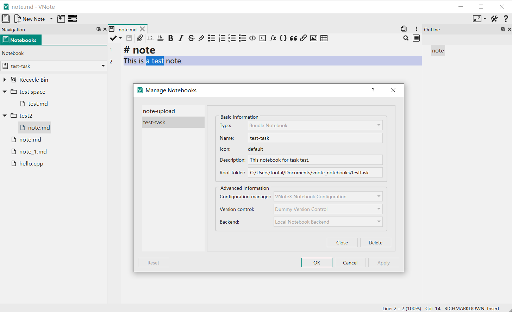


- `${notebookFolder}`，当前打开的笔记本文件夹路径，如`C:\Users\tootal\Documents\vnote_notebooks\testtask`。
- `${notebookFolderBasename}`，当前打开的笔记本文件夹名，如`testtask`。
- `${notebookName}`，当前打开的笔记本名，如`test-task`。
- `${notebookDescription}`，当前打开的笔记本描述，如`This notebook for task test.`。
- `${file}`，当前打开的文件路径，如`C:\Users\tootal\Documents\vnote_notebooks\testtask\test2\note.md`。
- `${fileNotebookFolder}`，当前打开的文件所在的笔记本文件夹路径，如`C:\Users\tootal\Documents\vnote_notebooks\testtask`。
- `${relativeFile}`，当前打开的文件相对于`${fileNotebookFolder}`的路径，如`test2\note.md`。
- `${fileBasename}`，当前打开的文件名，如`note.md`。
- `${fileBasenameNoExtension}`，当前打开的文件名（不含扩展名），如`note`。
- `${fileDirname}`，当前打开的文件所在的文件夹路径，如`C:\Users\tootal\Documents\vnote_notebooks\testtask\test2`。
- `${fileExtname}`，当前打开的文件的扩展名（包含点），如`.md`。
- `${cwd}`，当前任务开始运行时的工作目录，如`C:\Users\tootal\Documents\vnote_notebooks\testtask`。
- `${lineNumber}`，当前光标所在处的行号，如`2`。
- `${selectedText}`，当前选中的文本，如`a test`。
- `${execPath}`， VNote可执行文件的路径，如`C:\Programs\vnote3\vnote.exe`。
- `${pathSeparator}`，当前操作系统所用的路径分隔符，如`\`。
- `${taskFile}`，当前正在运行的任务配置文件路径。
- `${taskDirname}`，当前正在运行的任务配置文件所在的文件夹路径。
- `${notebookTaskFolder}`，当前笔记本任务配置文件夹路径，如`C:\Users\tootal\Documents\vnote_notebooks\testtask\vx_notebook\tasks`。
- `${userTaskFolder}`，VNote用户任务配置文件夹路径，如`C:\Users\tootal\AppData\Local\VNote\VNote\tasks`。
- `${appTaskFolder}`，VNote全局任务配置文件夹路径，如`C:\Users\tootal\AppData\Roaming\VNote\VNote\tasks`。
- `${userThemeFolder}`，VNote用户主题文件夹路径，如`C:\Users\tootal\AppData\Local\VNote\VNote\themes`。
- `${appThemeFolder}`，VNote全局主题文件夹路径，如`C:\Users\tootal\AppData\Roaming\VNote\VNote\themes`。
- `${userDocsFolder}`，VNote用户文档文件夹路径，如`C:\Users\tootal\AppData\Local\VNote\VNote\docs`。
- `${appDocsFolder}`，VNote全局文档文件夹路径，如`C:\Users\tootal\AppData\Roaming\VNote\VNote\docs`。

TODO: `${lineNumber}`、`${selectedText}`尚未实现。

变量基本与VSCode兼容。注意变量替换只在以下配置项中有效：`command`、`args`、`options.cwd`、`options.env`。如果变量的值不存在，则会被替换为空字符串。注意变量中的路径会使用**平台相关**的路径分隔符。

### 幻词变量

通过`${magic:word}`的语法可以引用幻词变量，下面列出了VNote支持的所有幻词及其含义：

- `d`, the day as number without a leading zero (`1` to `31`)
- `dd`, the day as number with a leading zero (`01` to `31`)
- `ddd`, the abbreviated localized day name (e.g. `Mon` to `Sun`)
- `dddd`, the long localized day name (e.g. `Monday` to `Sunday`)
- `M`, the month as number without a leading zero (`1` to `12`)
- `MM`, the month as number with a leading zero (`01` to `12`)
- `MMM`, the abbreviated localized month name (e.g. `Jan` to `Dec`)
- `MMMM`, the long localized month name (e.g. `January` to `December`)
- `yy`, the year as two digit number (`00` to `99`)
- `yyyy`, the year as four digit number
- `h`, the hour without a leading zero (`0` to `23` or `1` to `12` if AM/PM display)
- `hh`, the hour with a leading zero (`00` to `23` or `01` to `12` if AM/PM display)
- `H`, the hour without a leading zero (`0` to `23` even with AM/PM display)
- `HH`, the hour with a leading zero (`00` to `23` even with AM/PM display)
- `m`, the minute without a leading zero (`0` to `59`)
- `mm`, the minute with a leading zero (`00` to `59`)
- `s`, the second without a leading zero (`0` to `59`)
- `ss`, the second with a leading zero (`00` to `59`)
- `z`, the milliseconds without leading zeroes (`0` to `999`)
- `zzz`, the milliseconds with leading zeroes (`000` to `999`)
- `AP`, use AM/PM display (`AM` or `PM`)
- `A`, use AM/PM display (`AM` or `PM`)
- `ap`, use am/pm display (`am` or `pm`)
- `a`, use am/pm display (`am` or `pm`)
- `t`, the timezone (e.g. `CEST`)
- `random`, a random number
- `random_d`, dynamic version of `random`
- `date`, yyyy-MM-dd,
- `da`, yyyyMMdd
- `time`, hh:mm:ss
- `datetime`, date time
- `dt`, da-time
- `note`, name of current note
- `no`, complete base name of current note
- `att`, relative path of current note's attachment folder
- `w`, the week number (`1` to `53`)

例如：

* `${magic:datetime}` → `2021-01-29 12:59:03`
* `${magic:random}` → `56`

TODO: `att`、`random_d`尚未实现。

### 环境变量

可以用`${env:Name}`的语法引用系统定义的环境变量。

一些常见的环境变量如下所示：



<!-- tab Windows -->

* `${env:ComSpec}` → `C:\Windows\system32\cmd.exe`
* `${env:NUMBER_OF_PROCESSORS}` → `6`
* `${env:TEMP}` → `C:\Users\tootal\AppData\Local\Temp`

<!-- endtab -->


<!-- tab Linux -->

* HOME
* LOGNAME
* SHELL

<!-- endtab -->
<!-- tab MacOS -->

* PATH

<!-- endtab -->



### 配置变量

用`${config:core.locale}`的语法引用VNote的配置变量。以下面的配置文件为例：

```json
{
    "core": {
        "locale": "en_US"
    },
    "metadata": {
        "version": "3.0.0-beta.6"
    }
}

```

* `${config:core.locale}` → `en_US`
* `${config:metadata.version}` → `3.0.0-beta.6`

配置变量只能返回字符串类型的值，对于`Array`和`Object`返回空字符串、其余类型返回字符串结果。仅支持`object.key`的语法，不支持`object["key"]`，对于数组类型，支持`array[0]`的语法。

### 输入变量

上面的变量在一般情况下已经足够使用，但它们无法在运行时动态调整参数。例如要求在运行`git commit`时手动输入一些信息。参考[VSCode Tasks的Input variables](https://code.visualstudio.com/docs/editor/variables-reference#_input-variables)，VNote同样提供类似的功能。通过`${input:varid}`的语法可以引用一个输入变量。

如下任务配置文件`prompt.json`可以弹出一个输入框，并将输入的内容在输出面板输出。

```json
{
    "command": "echo",
    "args": ["${input:what}"],
    "inputs": [
        {
            "id": "what",
            "type": "promptString",
            "description": "Type something, it will show in output panel."
        }
    ]
}
```


运行效果如下图所示：

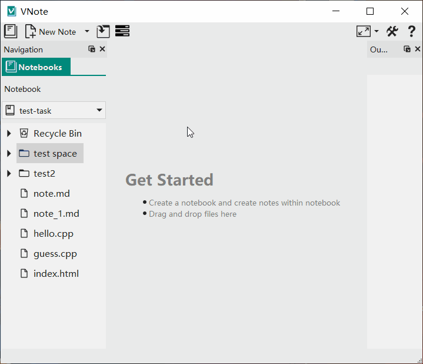

### Shell变量

通过`${shell:commandString}`可以获取一些简单的Shell命令的结果，执行时会先通过系统默认的shell执行 `commandString` ，将结果作为变量值进行替换。对于较复杂的命令，请使用输出变量。

例如：

* `${shell:git rev-parse --abbrev-ref HEAD}` → `master`
* `${shell:whoami}` → `tootal`
* `${shell:dig github.com -4 +short}` → `52.69.186.44`

shell的工作目录与任务工作目录相同。变量解析超过1秒后，会中断任务的执行。

## 输入输出

任务运行结果及错误信息可以通过输出面板进行查看，目前输出面板会依次尝试使用下列编码来显示输出：

* `UTF-8`
* `System`
* `UTF-16`
* `GB18030`


虽然有了输入变量可以进行一定程度的交互，但仍然不能很好的处理一些特殊情况。例如一些任务运行时需要进行多次输入确认、一些任务需要在后台保持运行等。VNote任务系统没有内置相关功能，但仍然可以通过启动一个额外的命令窗口来解决这些问题。下面以两个简单的示例来说明如何运行需要交互输入和后台运行的任务。

### 交互输入

下面是一个用C++编写的猜数小游戏，接下来将通过任务配置在VNote中编译、运行。

```cpp
#include <bits/stdc++.h>
using namespace std;
int main() {
    int low = 1, high = 20;
    cout << "Guess a number between "
         << low << " and " << high << ".\n";
    srand(time(0));
    int num = rand() % 20 + 1, x;
    while (true) {
        cin >> x;
        if (x > num) cout << "It's too high.\n";
        else if (x < num) cout << "It's too low\n";
        else {
            cout << "It is just fine\n";
            break;
        }
    }
    return 0;
}
```

新建一个任务配置文件`run.json`，内容如下：


<!-- tab Windows -->
```json
{
    "command": "g++ \"${file}\" -o \"${fileBasenameNoExtension}\"; if ($?) { start cmd \"/c `\"${fileBasenameNoExtension}`\" & pause\" }"
}
```

注意尽管命令较长，但不能将其拆分成`command`和`args`，否则可能由于转义字符导致任务执行失败。运行效果如下图所示：

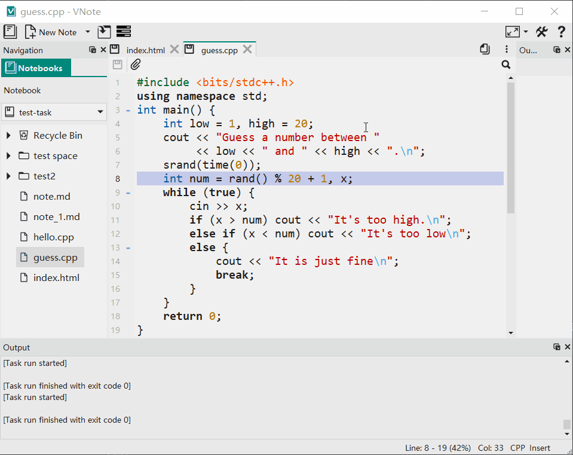

<!-- endtab -->

<!-- tab Linux -->
TODO
<!-- endtab -->

<!-- tab macOS -->
TODO
<!-- endtab -->


### 后台运行

下面的例子演示了如何在笔记本根目录启动一个http服务器，并打开浏览器访问。

若笔记本根目录下没有`index.html`文件，可以新建一个，内容如下：

```html
<!doctype html>
<html>
<head>
    <title>VNote Task</title>
</head>
<body>
    <p>HTTP server start successfully.</p>
</body>
</html>
```

新建一个任务配置文件`http.json`，内容如下：


<!-- tab Windows -->

```json
{
    "command": "start cmd.exe \"/c python -m http.server\" ; start http://localhost:8000"
}
```

运行效果如下图所示：

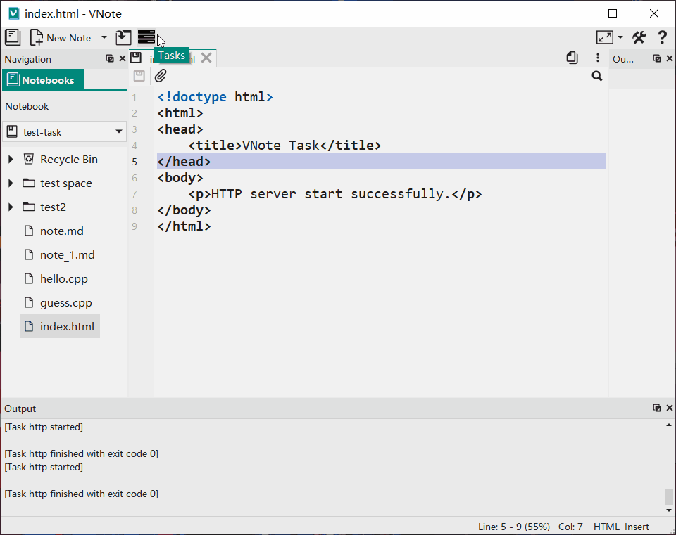

<!-- endtab -->

<!-- tab Linux -->
TODO
<!-- endtab -->

<!-- tab macOS -->
TODO
<!-- endtab -->


<!--
### 交互命令

上面两种方式虽然可以在一定程度上解决问题，但无法调用一些VNote已有的功能，通过交互命令可以在运行过程中于VNote进行沟通。


目前支持以下交互命令：

* `::show-message title={title}::{info}`
* `::show-question title={title}::{question}`

-->

## 任务示例

前面展示的一些任务示例较为简单，下面包含四个较完善的任务示例，用来解决文章开头的四个问题。

- [x] 通过[Git](https://git-scm.com/)进行笔记的版本控制
- [ ] 将多个终端的笔记通过[坚果云](https://help.jianguoyun.com/?p=2064)进行同步
- [ ] 将写好的Markdown文档通过[Hexo](https://hexo.io/zh-cn/)渲染预览并发布
- [ ] 调用外部编辑器如[Typora](https://typora.io/)或是[VS Code](https://code.visualstudio.com/)进行进一步编辑

所有任务均支持多语言与多平台。


### Git

通过Git进行版本控制是目前主流的选择，利用任务可以将一些Git的常用操作（如初始化、提交、上传、下载、查看日志）集成到VNote内部，大大方便了日常使用。如果目前笔记本尚未进行Git版本控制，需要先进行初始化，相当于命令`git init`。默认的分支名为`main`。

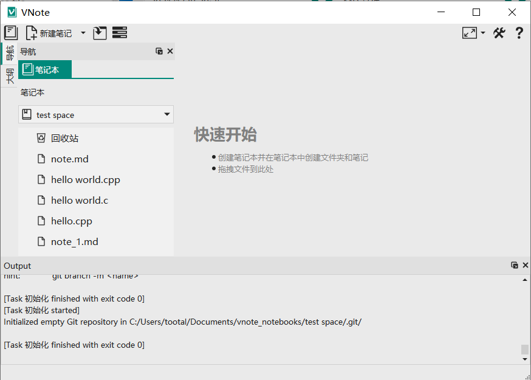

查看当前状态，相当于命令`git status`。

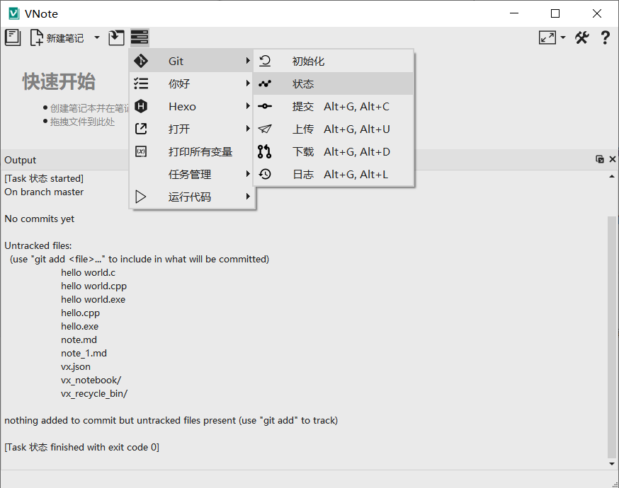

提示：查看状态时，中文文件名可能会显示为十六进制，这是由于Git默认会对值大于`0x80`的字符进行转义，可以使用`git config --global core.quotepath false`关闭转义，详细信息可参考[core.quotePath](https://git-scm.com/docs/git-config#Documentation/git-config.txt-corequotePath)。

提交可以把所有文件加入版本库中并生成一个记录，类似于命令`git add .` 与`git commit`同时执行。此时会弹出窗口请求输入提交信息，默认的提交信息是：`更新笔记于 ${magic:datetime}`，后面的变量表示当前时间。也可使用快捷键`Alt+G, Alt+C`执行提交。

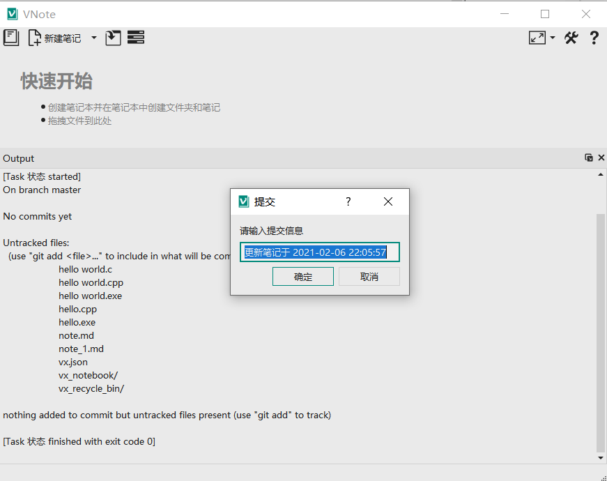


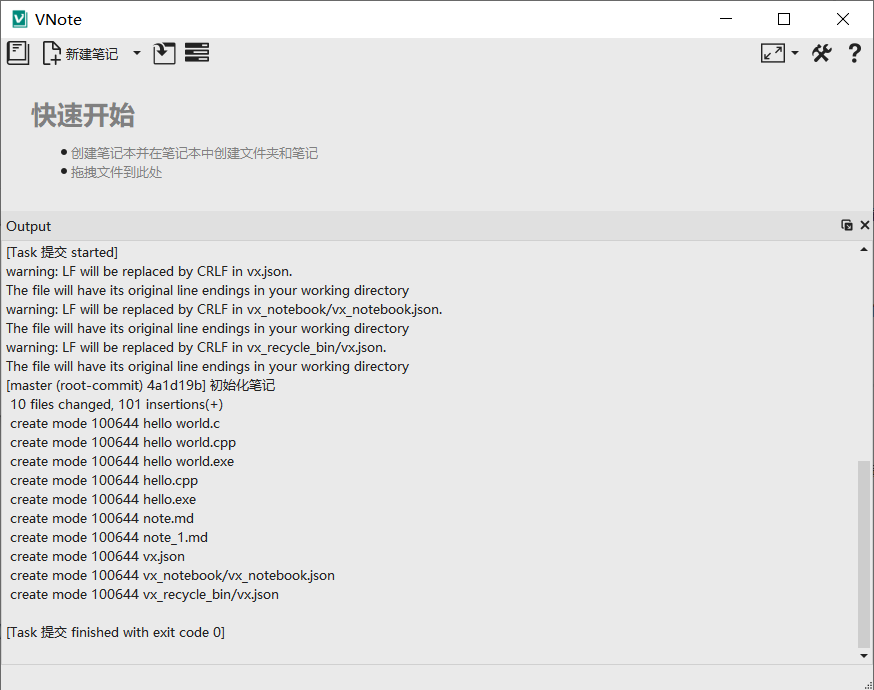

提交后需要手动配置云端库如Github等（利用`git remote`命令），便可使用快捷的菜单命令进行上传下载，相当于执行`git push`与`git pull`命令，默认的`merge`策略是`rebase`。通过日志可以查看目前的版本记录。

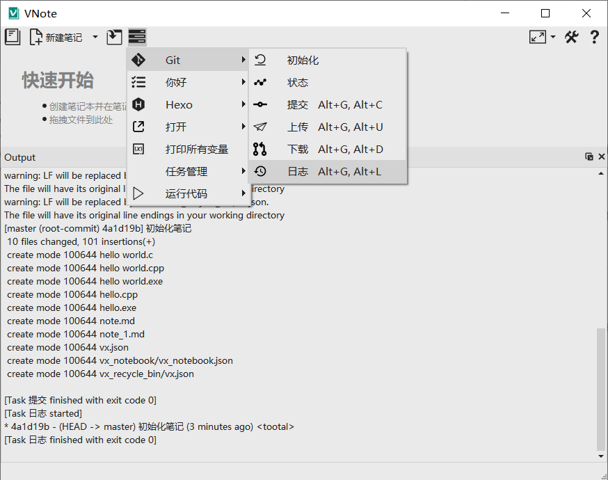

任务代码可在[Github](https://github.com/tootal/vnote-task-git)上查看。

## 常见问题


为何不采用系统环境变量`ComSpec`或`SHELL`的值作为默认shell？


默认shell可以很大程度地减小配置文件的大小，大部分任务配置也会按照默认的shell语法来书写。系统环境变量可能会被用户或其它程序在不经意间修改，从而导致大量已有的任务配置失效。

## 配置格式

参考[VSCode Task的配置格式](https://code.visualstudio.com/docs/editor/tasks-appendix)，定义VNote任务系统配置文件的格式如下。目前还在开发过程中，因此格式还在逐步调整。



<!-- option v0.1.0 -->
### v0.1.0

根task的默认label就是文件名，子label默认用数字从0开始编号。

```ts
interface TaskConfiguration extends TaskDescription {
  /**
   * The configuration's version number
   */
  version: '0.1.0';
}

interface TaskDescription {
  /**
   * The command to be executed. Can be an external program or a shell
   * command.
   */
  command: string;

  /**
   * The task's name. Can be omitted.
   */
  label?: string;

  /**
   * The configuration of the available tasks.
   */
  tasks?: TaskDescription[];
}
```

<!-- endoption -->

<!-- option v0.1.1 -->

没有新增内容，规定一下默认值的处理方法：

version，不指定则采用最新的version。
command，不指定则不运行。
label，默认采用文件名，子task采用数字编号（0-index）
tasks，指定子task。

```ts
interface TaskConfiguration extends TaskDescription {
  /**
   * The configuration's version number
   */
  version?: '0.1.1';
}

interface TaskDescription {
  /**
   * The command to be executed. Can be an external program or a shell
   * command.
   */
  command?: string;

  /**
   * The task's name. Can be omitted.
   */
  label?: string;

  /**
   * The configuration of the available tasks.
   */
  tasks?: TaskDescription[];
}
```

<!-- endoption -->

<!-- option v0.1.2 -->
### v0.1.2

```ts
interface TaskConfiguration extends TaskDescription {
    /**
     * The configuration's version number
     */
    version?: '0.1.2';
}

interface TaskDescription {
    /**
     * The type of a custom task. Tasks of type "shell" are executed
     * inside a shell (e.g. bash, cmd, powershell, ...)
     * If omitted `shell` is used.
     */
    type?: 'shell' | 'process';

    /**
     * The command to be executed. Can be an external program or a shell
     * command. Can be omitted.
     */
    command?: string;

    /**
     * The arguments passed to the command. Can be omitted.
     */
    args?: string[];

    /**
     * The task's name.
     * If root label omitted the file name is used.
     */
    label?: string;

    /**
      * The command options used when the command is executed. Can be omitted.
      */
    options?: CommandOptions;

    /**
     * The configuration of the available tasks.
     */
    tasks?: TaskDescription[];
}

/**
 * Options to be passed to the external program or shell
 */
export interface CommandOptions {
    /**
     * The current working directory of the executed program or shell.
     * If omitted try the following valus in turn.
     * - the current notebook's root
     * - the directory of current file
     * - the directory of executing task file
     */
    cwd?: string;

    /**
     * The environment of the executed program or shell. If omitted
     * the parent process' environment is used.
     */
    env?: { [key: string]: string };

    /**
     * Configuration of the shell when task type is `shell`
     */
    shell?: {
        /**
         * The shell to use. 
         * If omitted, the OS-specific shell is used.
         * - `cmd.exe` for windows
         * - `/bin/bash` for linux or macOS
         */
        executable: string;

        /**
         * The arguments to be passed to the shell executable to run in command mode.
         * If omitted, the default value is used.
         * - ['/D', '/S', '/C'] for `cmd.exe`
         * - ['-c'] for `/bin/bash`
         */
        args?: string[];
    };
}
```

<!-- endoption -->

<!-- option v0.1.3 -->
### v0.1.3
支持了翻译、平台相关配置。

```ts
interface TaskConfiguration {
    /**
     * The configuration's version number
     * If omitted latest version is used.
     */
    version?: '0.1.3';

    /**
     * Windows specific task configuration
     */
    windows?: TaskConfiguration;

    /**
     * macOS specific task configuration
     */
    osx?: TaskConfiguration;

    /**
     * Linux specific task configuration
     */
    linux?: TaskConfiguration;

    /**
     * The type of a custom task. Tasks of type "shell" are executed
     * inside a shell (e.g. bash, cmd, powershell, ...)
     * If omitted, the parent type is used
     * If no parent specific, the `shell` is used.
     */
    type?: 'shell' | 'process';

    /**
     * The command to be executed. Can be an external program or a shell
     * command. Can be omitted.
     */
    command?: string;

    /**
     * The arguments passed to the command. Can be omitted.
     */
    args?: string[];

    /**
     * The task's name.
     * If task has no parent, the file name is used.
     * If task has command, the command is used.
     */
    label?: string | TranslatableString;

    /**
      * The command options used when the command is executed. Can be omitted.
      */
    options?: CommandOptions;

    /**
     * The configuration of the available tasks.
     * Tasks will not be inherited.
     * Tasks in OS-specific will be merged.
     */
    tasks?: TaskConfiguration[];
}

/**
 * Options to be passed to the external program or shell
 */
interface CommandOptions {
    /**
     * The current working directory of the executed program or shell.
     * If omitted try the following valus in turn.
     * - the parent task working dir
     * - the current notebook's root
     * - the directory of current file
     * - the directory of executing task file
     */
    cwd?: string;

    /**
     * The environment of the executed program or shell.
     * If omitted the parent process' environment is used.
     */
    env?: { [key: string]: string };

    /**
     * Configuration of the shell when task type is `shell`
     */
    shell?: {
        /**
         * The shell to use. 
         * If omitted, the parent shell is used
         * If no parent specific, the OS-specific shell is used.
         * - `PowerShell.exe` for windows
         * - `/bin/bash` for linux or macOS
         */
        executable: string;

        /**
         * The arguments to be passed to the shell executable to run in command mode.
         * If omitted, the parent shell is used
         * If no parent specific, the default value is used.
         * - ['/D', '/S', '/C'] for `cmd.exe`
         * - ['-Command'] for `PowerShell.exe`
         * - ['-c'] for `/bin/bash`
         */
        args?: string[];
    };
}

/**
 * Localization
 */
interface TranslatableString {
    en_US?: string,
    zh_CN?: string
}
```

<!-- endoption -->
<!-- option v0.1.4 -->
### v0.1.4
支持输入变量

```ts
interface TaskConfiguration {
    /**
     * The configuration's version number
     * If omitted latest version is used.
     */
    version?: '0.1.4';

    /**
     * Windows specific task configuration
     */
    windows?: TaskConfiguration;

    /**
     * macOS specific task configuration
     */
    osx?: TaskConfiguration;

    /**
     * Linux specific task configuration
     */
    linux?: TaskConfiguration;

    /**
     * The type of a custom task. Tasks of type "shell" are executed
     * inside a shell (e.g. bash, cmd, powershell, ...)
     * If omitted, the parent type is used
     * If no parent specific, the `shell` is used.
     */
    type?: 'shell' | 'process';

    /**
     * The command to be executed. Can be an external program or a shell
     * command. Can be omitted.
     */
    command?: string;

    /**
     * The arguments passed to the command. Can be omitted.
     */
    args?: string[];

    /**
     * The task's name.
     * If task has no parent, the file name is used.
     * If task has command, the command is used.
     */
    label?: TranslatableString;

    /**
      * The command options used when the command is executed. Can be omitted.
      */
    options?: CommandOptions;

    /**
     * The configuration of the available tasks.
     * Tasks will not be inherited.
     * Tasks in OS-specific will be merged.
     */
    tasks?: TaskConfiguration[];

    /**
     * The configuration of the input variables.
     */
    inputs?: InputConfiguration[];
}

/**
 * Options to be passed to the external program or shell
 */
interface CommandOptions {
    /**
     * The current working directory of the executed program or shell.
     * If omitted try the following valus in turn.
     * - the parent task working dir
     * - the current notebook's root
     * - the directory of current file
     * - the directory of executing task file
     */
    cwd?: string;

    /**
     * The environment of the executed program or shell.
     * If omitted the parent process' environment is used.
     */
    env?: { [key: string]: string };

    /**
     * Configuration of the shell when task type is `shell`
     */
    shell?: {
        /**
         * The shell to use. 
         * If omitted, the parent shell is used
         * If no parent specific, the OS-specific shell is used.
         * - `PowerShell.exe` for windows
         * - `/bin/bash` for linux or macOS
         */
        executable: string;

        /**
         * The arguments to be passed to the shell executable to run in command mode.
         * If omitted, the parent shell is used
         * If no parent specific, the default value is used.
         * - ['/D', '/S', '/C'] for `cmd.exe`
         * - ['-Command'] for `PowerShell.exe`
         * - ['-c'] for `/bin/bash`
         */
        args?: string[];
    };
}

/**
 * Localization
 */
interface LocaleString {
    en_US?: string,
    zh_CN?: string
}

type TranslatableString = string | LocaleString;

/**
 * Configuration of input variables
 */
interface InputConfiguration {
    /**
     * Input variable id
     */
    id: string,
    /**
     * the type of input variable
     * if omitted, `promptString` is used.
     */
    type?: 'promptString' | 'pickString',
    /**
     * Provides context for the input.
     */
    description?: TranslatableString,
    /**
     * Default value that will be used if the user doesn't enter something else.
     * If type is pickString, it must be one of the option values.
     */
    default?: TranslatableString,
    /**
     * Only avaliable when type is promptString
     * Set to true to input with a password prompt that will not show the typed value.
     */
    password?: boolean,
    /**
     * Only avaliable when type is pickString
     * An array of options for the user to pick from.
     */
    options?: TranslatableString[]
}

```
<!-- endoption -->


<!-- option v0.1.5 -->
### v0.1.5
支持可翻译的命令字符串及参数。

```ts
interface TaskConfiguration {
    /**
     * The configuration's version number
     * If omitted latest version is used.
     */
    version?: '0.1.5';

    /**
     * Windows specific task configuration
     */
    windows?: TaskConfiguration;

    /**
     * macOS specific task configuration
     */
    osx?: TaskConfiguration;

    /**
     * Linux specific task configuration
     */
    linux?: TaskConfiguration;

    /**
     * The type of a custom task. Tasks of type "shell" are executed
     * inside a shell (e.g. bash, cmd, powershell, ...)
     * If omitted, the parent type is used
     * If no parent specific, the `shell` is used.
     */
    type?: 'shell' | 'process';

    /**
     * The command to be executed. Can be an external program or a shell
     * command. Can be omitted.
     */
    command?: TranslatableString;

    /**
     * The arguments passed to the command. Can be omitted.
     */
    args?: TranslatableString[];

    /**
     * The task's name.
     * If task has no parent, the file name is used.
     * If task has command, the command is used.
     */
    label?: TranslatableString;

    /**
      * The command options used when the command is executed. Can be omitted.
      */
    options?: CommandOptions;

    /**
     * The configuration of the available tasks.
     * Tasks will not be inherited.
     * Tasks in OS-specific will be merged.
     */
    tasks?: TaskConfiguration[];

    /**
     * The configuration of the input variables.
     */
    inputs?: InputConfiguration[];
}

/**
 * Options to be passed to the external program or shell
 */
interface CommandOptions {
    /**
     * The current working directory of the executed program or shell.
     * If omitted try the following valus in turn.
     * - the parent task working dir
     * - the current notebook's root
     * - the directory of current file
     * - the directory of executing task file
     */
    cwd?: string;

    /**
     * The environment of the executed program or shell.
     * If omitted the parent process' environment is used.
     */
    env?: { [key: string]: string };

    /**
     * Configuration of the shell when task type is `shell`
     */
    shell?: {
        /**
         * The shell to use. 
         * If omitted, the parent shell is used
         * If no parent specific, the OS-specific shell is used.
         * - `PowerShell.exe` for windows
         * - `/bin/bash` for linux or macOS
         */
        executable: string;

        /**
         * The arguments to be passed to the shell executable to run in command mode.
         * If omitted, the parent shell is used
         * If no parent specific, the default value is used.
         * - ['/D', '/S', '/C'] for `cmd.exe`
         * - ['-Command'] for `PowerShell.exe`
         * - ['-c'] for `/bin/bash`
         */
        args?: string[];
    };
}

/**
 * Localization
 */
interface LocaleString {
    en_US?: string,
    zh_CN?: string
}

type TranslatableString = string | LocaleString;

/**
 * Configuration of input variables
 */
interface InputConfiguration {
    /**
     * Input variable id
     */
    id: string,
    /**
     * the type of input variable
     * if omitted, `promptString` is used.
     */
    type?: 'promptString' | 'pickString',
    /**
     * Provides context for the input.
     */
    description?: TranslatableString,
    /**
     * Default value that will be used if the user doesn't enter something else.
     * If type is pickString, it must be one of the option values.
     */
    default?: TranslatableString,
    /**
     * Only avaliable when type is promptString
     * Set to true to input with a password prompt that will not show the typed value.
     */
    password?: boolean,
    /**
     * Only avaliable when type is pickString
     * An array of options for the user to pick from.
     */
    options?: TranslatableString[]
}
```

<!-- endoption -->

<!-- option v0.1.6 -->
### v0.1.6
支持了图标`icon`和快捷键`shortcut`。

```ts
interface TaskConfiguration {
    /**
     * The configuration's version number
     * If omitted latest version is used.
     */
    version?: '0.1.6';

    /**
     * Windows specific task configuration
     */
    windows?: TaskConfiguration;

    /**
     * macOS specific task configuration
     */
    osx?: TaskConfiguration;

    /**
     * Linux specific task configuration
     */
    linux?: TaskConfiguration;

    /**
     * The type of a custom task. Tasks of type "shell" are executed
     * inside a shell (e.g. bash, cmd, powershell, ...)
     * If omitted, the parent type is used
     * If no parent specific, the `shell` is used.
     */
    type?: 'shell' | 'process';

    /**
     * The command to be executed. Can be an external program or a shell
     * command. Can be omitted.
     */
    command?: TranslatableString;

    /**
     * The arguments passed to the command. Can be omitted.
     */
    args?: TranslatableString[];

    /**
     * The task's name.
     * If task has no parent, the file name is used.
     * If task has command, the command is used.
     */
    label?: TranslatableString;

    /**
     * The task's icon.
     * task icon will not be inherited
     */
    icon?: string;

    /**
     * The task's shortcut.
     * task icon will not be inherited
     */
    shortcut?: string;

    /**
      * The command options used when the command is executed. Can be omitted.
      */
    options?: CommandOptions;

    /**
     * The configuration of the available tasks.
     * Tasks will not be inherited.
     * Tasks in OS-specific will be merged.
     */
    tasks?: TaskConfiguration[];

    /**
     * The configuration of the input variables.
     */
    inputs?: InputConfiguration[];
}

/**
 * Options to be passed to the external program or shell
 */
interface CommandOptions {
    /**
     * The current working directory of the executed program or shell.
     * If omitted try the following valus in turn.
     * - the parent task working dir
     * - the current notebook's root
     * - the directory of current file
     * - the directory of executing task file
     */
    cwd?: string;

    /**
     * The environment of the executed program or shell.
     * If omitted the parent process' environment is used.
     */
    env?: { [key: string]: string };

    /**
     * Configuration of the shell when task type is `shell`
     */
    shell?: {
        /**
         * The shell to use. 
         * If omitted, the parent shell is used
         * If no parent specific, the OS-specific shell is used.
         * - `PowerShell.exe` for windows
         * - `/bin/bash` for linux or macOS
         */
        executable: string;

        /**
         * The arguments to be passed to the shell executable to run in command mode.
         * If omitted, the parent shell is used
         * If no parent specific, the default value is used.
         * - ['/D', '/S', '/C'] for `cmd.exe`
         * - ['-Command'] for `PowerShell.exe`
         * - ['-c'] for `/bin/bash`
         */
        args?: string[];
    };
}

/**
 * Localization
 */
interface LocaleString {
    en_US?: string,
    zh_CN?: string
}

type TranslatableString = string | LocaleString;

/**
 * Configuration of input variables
 */
interface InputConfiguration {
    /**
     * Input variable id
     */
    id: string,
    /**
     * the type of input variable
     * if omitted, `promptString` is used.
     */
    type?: 'promptString' | 'pickString',
    /**
     * Provides context for the input.
     */
    description?: TranslatableString,
    /**
     * Default value that will be used if the user doesn't enter something else.
     * If type is pickString, it must be one of the option values.
     */
    default?: TranslatableString,
    /**
     * Only avaliable when type is promptString
     * Set to true to input with a password prompt that will not show the typed value.
     */
    password?: boolean,
    /**
     * Only avaliable when type is pickString
     * An array of options for the user to pick from.
     */
    options?: TranslatableString[]
}
```
<!-- endoption -->

<!-- option v0.1.7 -->
### v0.1.7
支持环境变量多语言。

```ts
interface TaskConfiguration {
    /**
     * The configuration's version number
     * If omitted latest version is used.
     */
    version?: '0.1.7';

    /**
     * Windows specific task configuration
     */
    windows?: TaskConfiguration;

    /**
     * macOS specific task configuration
     */
    osx?: TaskConfiguration;

    /**
     * Linux specific task configuration
     */
    linux?: TaskConfiguration;

    /**
     * The type of a custom task. Tasks of type "shell" are executed
     * inside a shell (e.g. bash, cmd, powershell, ...)
     * If omitted, the parent type is used
     * If no parent specific, the `shell` is used.
     */
    type?: 'shell' | 'process';

    /**
     * The command to be executed. Can be an external program or a shell
     * command. Can be omitted.
     */
    command?: TranslatableString;

    /**
     * The arguments passed to the command. Can be omitted.
     */
    args?: TranslatableString[];

    /**
     * The task's name.
     * If task has no parent, the file name is used.
     * If task has command, the command is used.
     */
    label?: TranslatableString;

    /**
     * The task's icon.
     * task icon will not be inherited
     */
    icon?: string;

    /**
     * The task's shortcut.
     * task icon will not be inherited
     */
    shortcut?: string;

    /**
      * The command options used when the command is executed. Can be omitted.
      */
    options?: CommandOptions;

    /**
     * The configuration of the available tasks.
     * Tasks will not be inherited.
     * Tasks in OS-specific will be merged.
     */
    tasks?: TaskConfiguration[];

    /**
     * The configuration of the input variables.
     */
    inputs?: InputConfiguration[];
}

/**
 * Options to be passed to the external program or shell
 */
interface CommandOptions {
    /**
     * The current working directory of the executed program or shell.
     * If omitted try the following valus in turn.
     * - the parent task working dir
     * - the current notebook's root
     * - the directory of current file
     * - the directory of executing task file
     */
    cwd?: string;

    /**
     * The environment of the executed program or shell.
     * If omitted the parent process' environment is used.
     */
    env?: { [key: string]: TranslatableString };

    /**
     * Configuration of the shell when task type is `shell`
     */
    shell?: {
        /**
         * The shell to use. 
         * If omitted, the parent shell is used
         * If no parent specific, the OS-specific shell is used.
         * - `PowerShell.exe` for windows
         * - `/bin/bash` for linux or macOS
         */
        executable: string;

        /**
         * The arguments to be passed to the shell executable to run in command mode.
         * If omitted, the parent shell is used
         * If no parent specific, the default value is used.
         * - ['/D', '/S', '/C'] for `cmd.exe`
         * - ['-Command'] for `PowerShell.exe`
         * - ['-c'] for `/bin/bash`
         */
        args?: string[];
    };
}

/**
 * Localization
 */
interface LocaleString {
    en_US?: string,
    zh_CN?: string
}

type TranslatableString = string | LocaleString;

/**
 * Configuration of input variables
 */
interface InputConfiguration {
    /**
     * Input variable id
     */
    id: string,
    /**
     * the type of input variable
     * if omitted, `promptString` is used.
     */
    type?: 'promptString' | 'pickString',
    /**
     * Provides context for the input.
     */
    description?: TranslatableString,
    /**
     * Default value that will be used if the user doesn't enter something else.
     * If type is pickString, it must be one of the option values.
     */
    default?: TranslatableString,
    /**
     * Only avaliable when type is promptString
     * Set to true to input with a password prompt that will not show the typed value.
     */
    password?: boolean,
    /**
     * Only avaliable when type is pickString
     * An array of options for the user to pick from.
     */
    options?: TranslatableString[]
}
```

<!-- endoption -->



